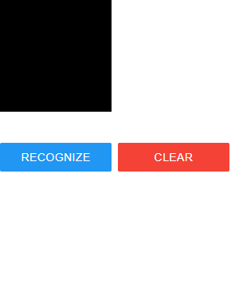

# number-recognition-tfjs

This project is a simple demo shows how to train a tensoflow model with python and deploy it in frontend.

python requirements:
* flask
* flask-cors

if you want to train the model youself, you need 
* tensorflow
* tensorflowjs

You can install all of them with pip.

run the server:
```
cd server
python main.py
```
By default, the server would be running at port 5000. Open this url http://localhost:5000/, if you see 'Hello World!' in the screen, it means the server is set up successfully.

Open the file web/index.html in you brower. If everything is ok, you should see this:



Then you can draw the digit on the black canvas and click the 'recognize' button to check the prediction.

